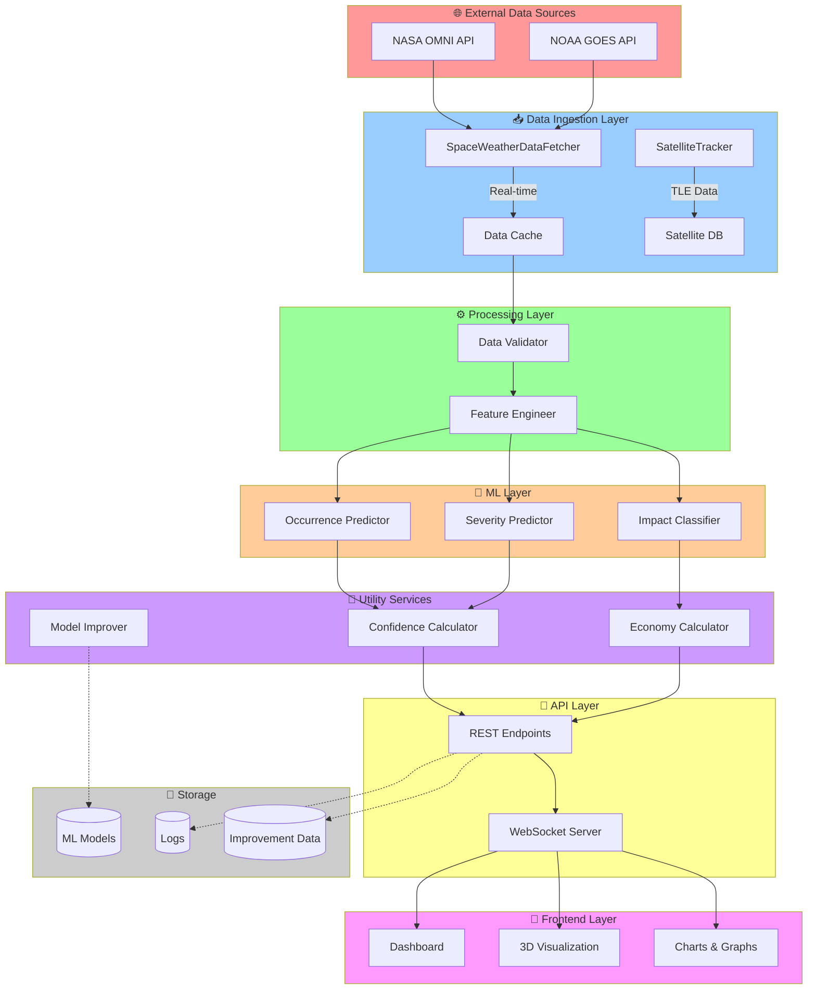
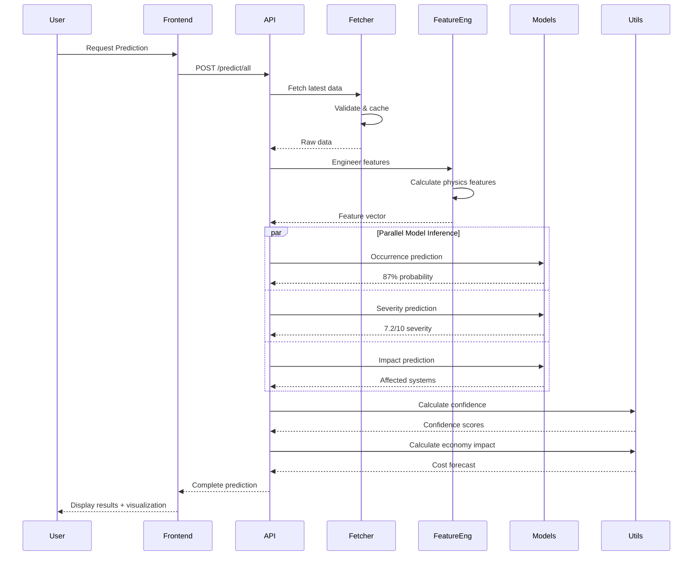
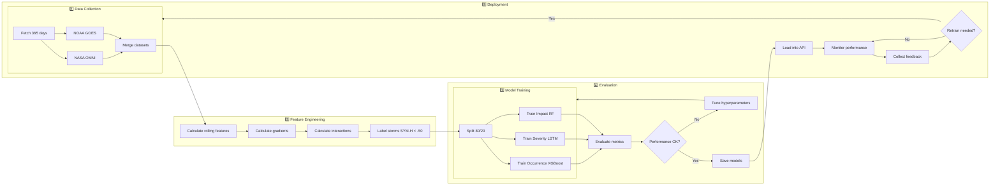
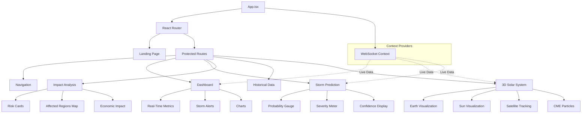
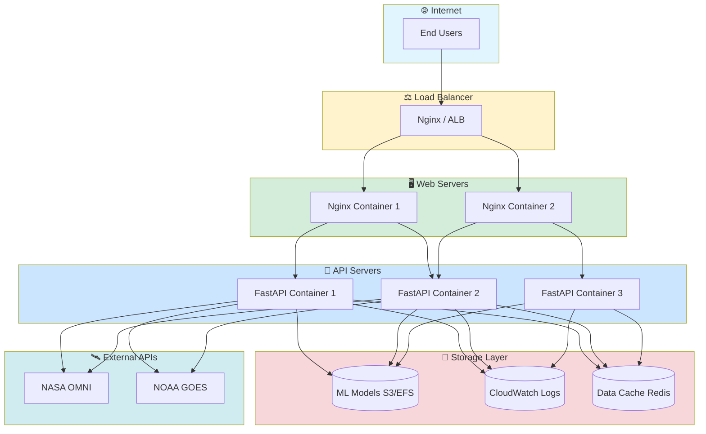
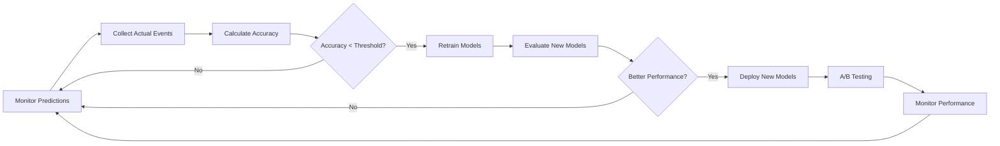

# 🌞 SolarSheild - Complete System Architecture

## 📋 Table of Contents
1. [System Overview](#system-overview)
2. [High-Level Architecture](#high-level-architecture)
3. [Component Architecture](#component-architecture)
4. [Data Flow Architecture](#data-flow-architecture)
5. [Machine Learning Pipeline](#machine-learning-pipeline)
6. [API Architecture](#api-architecture)
7. [Frontend Architecture](#frontend-architecture)
8. [Deployment Architecture](#deployment-architecture)
9. [Technology Stack](#technology-stack)
10. [Security & Scalability](#security--scalability)

---

## 🎯 System Overview

**SolarSheild** is an AI-powered space weather intelligence platform that predicts solar storms and their impacts on Earth's infrastructure. The system combines real-time data from NASA and NOAA, advanced machine learning models, and interactive 3D visualization to provide actionable space weather forecasts.

### Core Capabilities
- 🌊 **Real-time Solar Storm Prediction** - 12-24 hour advance warning
- 📊 **Severity Assessment** - Quantitative storm impact scoring (0-10 scale)
- 🛰️ **Infrastructure Risk Analysis** - Satellites, GPS, communications, power grids
- 🌍 **3D Interactive Visualization** - Real-time solar system simulation
- 📡 **Satellite Tracking** - Monitor 50+ satellites in real-time
- 🔮 **Explainable AI** - SHAP-based model interpretability
- 💰 **Economic Impact Forecasting** - Cost prediction for storm damage
- 📈 **Continuous Learning** - Automated model improvement pipeline

---

## 🏗️ High-Level Architecture

```
┌──────────────────────────────────────────────────────────────────────┐
│                    SPACE WEATHER DATA SOURCES                        │
├──────────────────────────────────────────────────────────────────────┤
│                                                                      │
│  ┌─────────────────┐              ┌────────────────┐               │
│  │   NASA OMNI     │              │   NOAA GOES    │               │
│  │                 │              │                │               │
│  │  • IMF Bz       │              │  • X-ray flux  │               │
│  │  • Speed        │              │  • Proton flux │               │
│  │  • Density      │              │                │               │
│  │  • SYM-H        │              │                │               │
│  └────────┬────────┘              └────────┬───────┘               │
│           │                                │                        │
└───────────┼────────────────────────────────┼────────────────────────┘
            │                                │
            └────────────┬───────────────────┘
                         │
                         ▼
┌──────────────────────────────────────────────────────────────────────┐
│                     DATA INGESTION LAYER                             │
│                   (backend/data/fetcher.py)                          │
├──────────────────────────────────────────────────────────────────────┤
│                                                                      │
│  ┌────────────────────────────────────────────────────────────┐    │
│  │  SpaceWeatherDataFetcher                                   │    │
│  │                                                            │    │
│  │  • fetch_omni_data()        → Solar wind parameters        │    │
│  │  • fetch_goes_data()        → X-ray & proton flux          │    │
│  │  • fetch_realtime_data()    → Latest measurements          │    │
│  │  • fetch_training_data()    → Historical data (365 days)   │    │
│  └────────────────────────────────────────────────────────────┘    │
│                                                                      │
│  ┌────────────────────────────────────────────────────────────┐    │
│  │  SatelliteTracker                                          │    │
│  │  (backend/data/satellite_tracker.py)                       │    │
│  │                                                            │    │
│  │  • Track 50+ real satellites (GPS, GLONASS, Galileo, etc) │    │
│  │  • Calculate positions from TLE data                       │    │
│  │  • Assess radiation exposure risk                          │    │
│  │  • Monitor satellite health & vulnerabilities              │    │
│  └────────────────────────────────────────────────────────────┘    │
│                                                                      │
└──────────────────────────────┬───────────────────────────────────────┘
                               │
                               ▼
┌──────────────────────────────────────────────────────────────────────┐
│                   FEATURE ENGINEERING LAYER                          │
│              (backend/data/feature_engineer.py)                      │
├──────────────────────────────────────────────────────────────────────┤
│                                                                      │
│  ┌────────────────────────────────────────────────────────────┐    │
│  │  Physics-Based Feature Engineering                         │    │
│  │                                                            │    │
│  │  ROLLING FEATURES (Energy Buildup):                       │    │
│  │  • bz_rolling_30min, bz_rolling_60min                     │    │
│  │  • speed_rolling_mean, speed_rolling_max                  │    │
│  │  • proton_cumulative                                      │    │
│  │                                                            │    │
│  │  GRADIENT FEATURES (Shock Detection):                     │    │
│  │  • bz_gradient (ΔBz/Δt)                                   │    │
│  │  • pressure_spike                                         │    │
│  │  • proton_gradient                                        │    │
│  │                                                            │    │
│  │  INTERACTION FEATURES:                                     │    │
│  │  • energy_coupling = v * Bz² * sin⁴(θ/2)                 │    │
│  │  • ram_pressure = 1.67×10⁻⁶ * n * v²                     │    │
│  └────────────────────────────────────────────────────────────┘    │
│                                                                      │
└──────────────────────────────┬───────────────────────────────────────┘
                               │
                               ▼
┌──────────────────────────────────────────────────────────────────────┐
│                       AI/ML MODEL LAYER                              │
│                      (backend/ml/*.py)                               │
├──────────────────────────────────────────────────────────────────────┤
│                                                                      │
│  ┌────────────────────────────────────────────────────────────┐    │
│  │  MODEL A: Storm Occurrence Predictor                       │    │
│  │  ┌──────────────────────────────────────────────────┐      │    │
│  │  │  Algorithm: XGBoost (Binary Classifier)         │      │    │
│  │  │  Question: Will storm occur in 12-24 hrs?       │      │    │
│  │  │  Input: 6 features (Bz, speed, gradients...)    │      │    │
│  │  │  Output: Yes/No + Probability                   │      │    │
│  │  │  Accuracy: ~87%                                 │      │    │
│  │  └──────────────────────────────────────────────────┘      │    │
│  └────────────────────────────────────────────────────────────┘    │
│                                                                      │
│  ┌────────────────────────────────────────────────────────────┐    │
│  │  MODEL B: Storm Severity Predictor                         │    │
│  │  ┌──────────────────────────────────────────────────┐      │    │
│  │  │  Algorithm: LSTM (Time-Series Regression)       │      │    │
│  │  │  Question: How severe? (0-10 scale)             │      │    │
│  │  │  Input: 60-min sequences × 6 features           │      │    │
│  │  │  Architecture: 64→32 LSTM units                 │      │    │
│  │  │  Output: Severity score + Category              │      │    │
│  │  │  MAE: ~1.2                                      │      │    │
│  │  └──────────────────────────────────────────────────┘      │    │
│  └────────────────────────────────────────────────────────────┘    │
│                                                                      │
│  ┌────────────────────────────────────────────────────────────┐    │
│  │  MODEL C: Impact Risk Classifier                           │    │
│  │  ┌──────────────────────────────────────────────────┐      │    │
│  │  │  Algorithm: Random Forest (Multi-Label)         │      │    │
│  │  │  Question: Which systems affected?              │      │    │
│  │  │  Categories: 🛰️ Satellites, 📡 GPS,             │      │    │
│  │  │              📻 Communication, ⚡ Power Grid      │      │    │
│  │  │  Output: Risk probability per system            │      │    │
│  │  │  Accuracy: ~85%                                 │      │    │
│  │  └──────────────────────────────────────────────────┘      │    │
│  └────────────────────────────────────────────────────────────┘    │
│                                                                      │
└──────────────────────────────┬───────────────────────────────────────┘
                               │
                               ▼
┌──────────────────────────────────────────────────────────────────────┐
│                      API / BACKEND LAYER                             │
│                     (backend/main.py)                                │
├──────────────────────────────────────────────────────────────────────┤
│                                                                      │
│  ┌────────────────────────────────────────────────────────────┐    │
│  │  FastAPI REST Endpoints                                    │    │
│  │                                                            │    │
│  │  POST /predict/storm        → Storm occurrence prediction  │    │
│  │  POST /predict/severity     → Severity assessment          │    │
│  │  POST /predict/impact       → Infrastructure risk          │    │
│  │  GET  /predict/all          → All predictions combined     │    │
│  │  GET  /realtime/status      → Live data + predictions      │    │
│  │  GET  /realtime/satellites  → Satellite fleet status       │    │
│  │  GET  /explain/shap         → AI explainability           │    │
│  │  POST /predict/confidence   → Prediction confidence        │    │
│  │  POST /predict/economy      → Economic impact forecast     │    │
│  │  WS   /realtime/stream      → WebSocket streaming          │    │
│  │  GET  /health               → System health check          │    │
│  │  GET  /models/info          → Model metadata              │    │
│  │  POST /models/improve       → Trigger model improvement    │    │
│  └────────────────────────────────────────────────────────────┘    │
│                                                                      │
│  ┌────────────────────────────────────────────────────────────┐    │
│  │  Utility Services                                          │    │
│  │                                                            │    │
│  │  • ConfidenceCalculator     → Prediction reliability       │    │
│  │  • EconomyCalculator        → Cost forecasting             │    │
│  │  • ModelImprover            → Continuous learning          │    │
│  │  • Logger                   → Centralized logging          │    │
│  └────────────────────────────────────────────────────────────┘    │
│                                                                      │
└──────────────────────────────┬───────────────────────────────────────┘
                               │
                               ▼
┌──────────────────────────────────────────────────────────────────────┐
│                    FRONTEND / VISUALIZATION LAYER                    │
│                  (React + Three.js + TypeScript)                     │
├──────────────────────────────────────────────────────────────────────┤
│                                                                      │
│  ┌────────────────────────────────────────────────────────────┐    │
│  │  3D Solar System Visualization (Three.js/R3F)              │    │
│  │                                                            │    │
│  │  ☀️  SUN                                                    │    │
│  │     • Dynamic glow based on X-ray flux                    │    │
│  │     • Solar flare particle effects                        │    │
│  │     • Real-time activity indicators                       │    │
│  │                                                            │    │
│  │  🌊 CME (Coronal Mass Ejection)                           │    │
│  │     • Particle streams from Sun to Earth                  │    │
│  │     • Speed visualization (solar wind velocity)           │    │
│  │     • Density representation                              │    │
│  │                                                            │    │
│  │  🌍 EARTH                                                   │    │
│  │     • Magnetosphere visualization with shader effects     │    │
│  │     • Dynamic compression based on Bz/pressure            │    │
│  │     • Aurora effects during storms (North/South)          │    │
│  │     • Bow shock wave visualization                        │    │
│  │                                                            │    │
│  │  🛰️ SATELLITES (50+ tracked)                              │    │
│  │     • Real orbital positions (TLE-based)                  │    │
│  │     • Risk level indicators (color-coded)                 │    │
│  │     • Clickable for detailed status                       │    │
│  │     • Constellation grouping (GPS, GLONASS, Galileo)      │    │
│  └────────────────────────────────────────────────────────────┘    │
│                                                                      │
│  ┌────────────────────────────────────────────────────────────┐    │
│  │  Interactive Dashboard Pages                               │    │
│  │                                                            │    │
│  │  📊 DASHBOARD                                              │    │
│  │     • Real-time metrics display                           │    │
│  │     • Storm alerts and warnings                           │    │
│  │     • System health overview                              │    │
│  │                                                            │    │
│  │  🔮 STORM PREDICTION                                       │    │
│  │     • Occurrence probability gauge (0-100%)               │    │
│  │     • Severity meter (0-10 scale)                         │    │
│  │     • Time-to-impact countdown                            │    │
│  │     • Confidence intervals                                │    │
│  │                                                            │    │
│  │  ⚠️ IMPACT ANALYSIS                                        │    │
│  │     • Infrastructure risk cards                           │    │
│  │     • Affected regions map                                │    │
│  │     • Economic impact forecast                            │    │
│  │     • Mitigation recommendations                          │    │
│  │                                                            │    │
│  │  📈 HISTORICAL DATA                                        │    │
│  │     • Past storm events timeline                          │    │
│  │     • Model performance metrics                           │    │
│  │     • Data visualization charts                           │    │
│  │                                                            │    │
│  │  🌌 3D SOLAR SYSTEM VIEW                                   │    │
│  │     • Interactive 3D visualization                        │    │
│  │     • Real-time physics simulation                        │    │
│  │     • Satellite tracking overlay                          │    │
│  └────────────────────────────────────────────────────────────┘    │
│                                                                      │
│  ┌────────────────────────────────────────────────────────────┐    │
│  │  Real-time Components                                      │    │
│  │                                                            │    │
│  │  • WebSocket client (auto-reconnect)                      │    │
│  │  • Live data streaming                                    │    │
│  │  • Push notifications for critical events                 │    │
│  │  • Automatic UI updates (60s interval)                    │    │
│  └────────────────────────────────────────────────────────────┘    │
│                                                                      │
└──────────────────────────────────────────────────────────────────────┘
```

---

## 🔧 Component Architecture

### Backend Components Structure

#### 1. Data Layer (`backend/data/`)
```
data/
├── __init__.py
├── fetcher.py              # SpaceWeatherDataFetcher
│   ├── fetch_omni_data()   # NASA OMNI solar wind data
│   ├── fetch_goes_data()   # NOAA satellite data
│   ├── fetch_realtime_data()
│   └── fetch_training_data()
│
├── feature_engineer.py     # FeatureEngineer
│   ├── calculate_rolling_features()
│   ├── calculate_gradient_features()
│   ├── calculate_interaction_features()
│   └── engineer_features()
│
└── satellite_tracker.py    # SatelliteTracker
    ├── load_tle_data()
    ├── calculate_position()
    ├── assess_risk()
    └── get_fleet_status()
```

**Key Features:**
- Async data fetching from multiple sources
- Automatic retry logic with exponential backoff
- Data validation and cleaning
- Feature engineering with physics-based calculations
- Real-time satellite position tracking from TLE data

#### 2. ML Layer (`backend/ml/`)
```
ml/
├── __init__.py
├── storm_occurrence.py     # StormOccurrencePredictor
│   ├── Algorithm: XGBoost
│   ├── Target: Binary (storm/no-storm)
│   └── Accuracy: ~87%
│
├── storm_severity.py       # StormSeverityPredictor
│   ├── Algorithm: LSTM (TensorFlow)
│   ├── Target: Regression (0-10 scale)
│   └── MAE: ~1.2
│
├── impact_risk.py          # ImpactRiskClassifier
│   ├── Algorithm: Random Forest
│   ├── Target: Multi-label classification
│   └── Accuracy: ~85%
│
└── train_pipeline.py       # Complete training pipeline
    ├── data_preparation()
    ├── train_all_models()
    └── evaluate_models()
```

**Model Details:**

| Model | Algorithm | Input Features | Output | Metrics |
|-------|-----------|----------------|--------|---------|
| Occurrence | XGBoost | 6 features | Binary (Yes/No) | Acc: 87%, AUC: 0.91 |
| Severity | LSTM | 60-min × 6 features | Severity (0-10) | MAE: 1.2, RMSE: 1.8 |
| Impact | Random Forest | 8 features | Multi-label risks | F1: 0.85 |

#### 3. Utility Layer (`backend/utils/`)
```
utils/
├── __init__.py
├── helpers.py              # General utility functions
│   ├── risk_level()
│   ├── categorize_severity()
│   ├── get_impacts()
│   ├── validate_data()
│   └── format_timestamp()
│
├── confidence_calculator.py # ConfidenceCalculator
│   ├── calculate_occurrence_confidence()
│   ├── calculate_severity_confidence()
│   └── calculate_dataset_quality()
│
├── economy_loss.py         # EconomyCalculator
│   ├── calculate_satellite_loss()
│   ├── calculate_power_grid_loss()
│   └── calculate_total_impact()
│
├── model_improver.py       # ModelImprover
│   ├── collect_feedback()
│   ├── retrain_models()
│   └── evaluate_improvement()
│
└── logger.py               # Centralized logging
    └── get_logger()
```

#### 4. API Layer (`backend/main.py`)
**FastAPI Application with:**
- RESTful endpoints for predictions
- WebSocket streaming for real-time updates
- CORS middleware for cross-origin requests
- Pydantic models for request/response validation
- Error handling and logging
- Health checks and monitoring

### Frontend Components Structure

#### 1. Pages (`frontend/src/pages/`)
```
pages/
├── Landing.tsx             # Landing page
├── Dashboard.tsx           # Main dashboard
├── StormPrediction.tsx     # Prediction interface
├── ImpactAnalysis.tsx      # Impact assessment
├── HistoricalData.tsx      # Historical trends
└── SolarSystem3DView.tsx   # 3D visualization
```

#### 2. Components (`frontend/src/components/`)
```
components/
├── Navigation.tsx          # Top navigation bar
├── StormAlert.tsx          # Alert notifications
├── RealTimeMetrics.tsx     # Live metric displays
├── RadiationChart.tsx      # Radiation levels chart
├── SolarWindChart.tsx      # Solar wind data chart
├── AffectedRegionsMap.tsx  # Geographic impact map
├── SatelliteMonitor.tsx    # Satellite fleet status
├── EarthVisualization.tsx  # 3D Earth with magnetosphere
├── SolarSystemVisualization.tsx  # Complete solar system
└── ModelImprovementStatus.tsx    # ML model status
```

#### 3. Context (`frontend/src/context/`)
```
context/
└── WebSocketContext.tsx    # WebSocket provider
    ├── Auto-reconnect logic
    ├── Message handling
    └── State management
```

---

## 📊 Data Flow Architecture

### Complete System Data Flow Diagram



### Real-time Prediction Flow (Sequence Diagram)



---

## 🎓 Machine Learning Pipeline

### Training Pipeline Architecture



### Feature Engineering Pipeline

**Input Features (6 core):**
1. `bz` - IMF Bz component (nT)
2. `speed` - Solar wind speed (km/s)
3. `density` - Proton density (n/cm³)
4. `temperature` - Proton temperature (K)
5. `proton_flux` - Proton flux (p/cm²/s/sr)
6. `xray_flux` - X-ray flux (W/m²)

**Engineered Features (20+):**

| Category | Features | Formula/Description |
|----------|----------|-------------------|
| **Rolling** | bz_rolling_30min, bz_rolling_60min | Moving averages for trend detection |
| | speed_rolling_mean, speed_rolling_max | Wind speed momentum |
| | proton_cumulative | Accumulated radiation exposure |
| **Gradient** | bz_gradient | ΔBz/Δt - Shock detection |
| | pressure_spike | Sudden pressure changes |
| | proton_gradient | Radiation increase rate |
| **Interaction** | energy_coupling | $v \times Bz^2 \times \sin^4(\theta/2)$ |
| | ram_pressure | $1.67×10^{-6} \times n \times v^2$ |
| | dynamic_pressure | $\frac{1}{2} \rho v^2$ |

---

## 🌐 API Architecture

### REST API Endpoints

| Method | Endpoint | Description | Input | Output |
|--------|----------|-------------|-------|--------|
| POST | `/predict/storm` | Storm occurrence prediction | SpaceWeatherData | Probability, risk level |
| POST | `/predict/severity` | Storm severity assessment | SpaceWeatherData | Severity score (0-10) |
| POST | `/predict/impact` | Infrastructure risk analysis | SpaceWeatherData | Affected systems list |
| GET | `/predict/all` | All predictions combined | - | Complete forecast |
| GET | `/realtime/status` | Current space weather + predictions | - | Live status |
| GET | `/realtime/satellites` | Satellite fleet monitoring | - | 50+ satellite statuses |
| GET | `/explain/shap` | AI model explanation | - | SHAP values & plots |
| POST | `/predict/confidence` | Prediction confidence scores | PredictionData | Confidence metrics |
| POST | `/predict/economy` | Economic impact forecast | ImpactData | Cost estimates |
| POST | `/models/improve` | Trigger model retraining | FeedbackData | Improvement status |
| GET | `/health` | System health check | - | Status, uptime, version |
| GET | `/models/info` | Model metadata | - | Versions, metrics |

### WebSocket Streams

**Endpoint:** `ws://localhost:8000/realtime/stream`

**Message Types:**
```json
{
  "type": "prediction_update",
  "timestamp": "2026-02-06T10:30:00Z",
  "data": {
    "storm_probability": 0.87,
    "severity_score": 7.2,
    "affected_systems": ["satellites", "gps", "communications"],
    "confidence": 0.82,
    "economic_impact": 45000000
  }
}
```

```json
{
  "type": "satellite_update",
  "timestamp": "2026-02-06T10:30:00Z",
  "satellites": [
    {
      "id": "GPS BIIA-27",
      "position": [12345.6, -23456.7, 34567.8],
      "risk_level": "HIGH",
      "radiation_exposure": 8.5
    }
  ]
}
```

```json
{
  "type": "alert",
  "severity": "CRITICAL",
  "message": "Severe solar storm predicted in 12 hours",
  "actions": ["Enable redundant systems", "Notify operators"]
}
```

---

## 🎨 Frontend Architecture

### Application Structure



### State Management

**WebSocket Context:**
- Maintains persistent connection to backend
- Auto-reconnect with exponential backoff
- Broadcasts updates to all subscribed components
- Handles connection state (connecting, connected, disconnected)

**Component State:**
- Local state with React hooks
- Real-time updates from WebSocket
- Optimistic UI updates
- Error boundary fallbacks

---

## 🐳 Deployment Architecture

### Docker Compose Setup

```yaml
services:
  backend:
    build: ./backend
    ports: ["8000:8000"]
    volumes:
      - ./data:/app/data
      - ./models:/app/models
      - ./logs:/app/logs
    restart: unless-stopped
    
  frontend:
    build: ./frontend
    ports: ["80:80"]
    depends_on: [backend]
    restart: unless-stopped
```

### Production Deployment



### Scaling Strategies

1. **Horizontal Scaling:**
   - Multiple API server instances behind load balancer
   - Stateless design for easy replication
   - Redis for shared caching

2. **Vertical Scaling:**
   - GPU instances for ML inference
   - Memory optimization for LSTM models
   - CPU optimization for XGBoost/RF

3. **Caching Strategy:**
   - API response caching (60s TTL)
   - Model prediction caching
   - Static asset CDN

4. **Database Strategy:**
   - Read replicas for historical data
   - Write-heavy optimization for logs
   - Time-series DB for metrics

---

## 🛠️ Technology Stack

### Backend Stack
│ Model B             │ TensorFlow/Keras, LSTM                      │
│ Model C             │ scikit-learn, Random Forest                 │
│ Explainability      │ SHAP                                        │
│ API Backend         │ FastAPI, Uvicorn, Pydantic                  │
│ Real-time Streaming │ WebSockets                                  │
│ Logging             │ Loguru                                      │
│ Frontend (planned)  │ React, Three.js, React Three Fiber          │
└─────────────────────┴──────────────────────────────────────────────┘

═══════════════════════════════════════════════════════════════════════

                        DATA FLOW EXAMPLE

1. 🌞 Solar flare detected on Sun
   ↓
2. 📡 NOAA GOES satellite measures X-ray spike (1.5×10⁻⁵ W/m²)
   ↓
3. 🌊 CME launches → solar wind speed increases to 650 km/s
   ↓
4. 🧲 IMF Bz turns southward (-12 nT)
   ↓
5. 📊 Data Fetcher retrieves measurements
   ↓
6. ⚙️ Feature Engineer calculates:
   - Energy coupling: 5,070
   - Ram pressure: 7.8 nPa
   - Bz gradient: -2.4 nT/min
   ↓
7. 🤖 AI Models predict:
   - Storm occurrence: 87% (CRITICAL)
   - Severity: 7.2/10 (SEVERE)
   - Impacts: Satellites ✓, GPS ✓, Comm ✓
   ↓
8. 🚀 API returns predictions via WebSocket
   ↓
9. 🎨 Frontend visualizes:
   - Sun glows brighter
   - CME particle stream travels
   - Earth's magnetosphere compresses
   - Red aurora forms at poles
   ↓
10. 👨‍💻 User sees real-time 3D physics simulation
    + receives actionable alerts

═══════════════════════════════════════════════════════════════════════

                    DEPLOYMENT ARCHITECTURE

┌────────────────────────────────────────────────────────────────────┐
│                         PRODUCTION SETUP                           │
├────────────────────────────────────────────────────────────────────┤
│                                                                    │
│   ┌─────────────┐         ┌──────────────┐      ┌─────────────┐  │
│   │   Nginx     │────────▶│   FastAPI    │─────▶│   Models    │  │
│   │ (Reverse    │         │   Backend    │      │   (.pkl,    │  │
│   │  Proxy)     │         │   (Uvicorn)  │      │    .h5)     │  │
│   └─────────────┘         └──────────────┘      └─────────────┘  │
│         │                                                          │
│         │                                                          │
│         ▼                                                          │
│   ┌─────────────┐                                                 │
│   │   React     │                                                 │
│   │   Frontend  │                                                 │
│   │  (Three.js) │                                                 │
│   └─────────────┘                                                 │
│                                                                    │
└────────────────────────────────────────────────────────────────────┘

═══════════════════════════════════════════════════════════════════════
```

## Training Pipeline Flow

```
START
  │
  ├─→ Fetch 365 days of historical data
  │    • NASA OMNI: Solar wind parameters
  │    • NOAA GOES: X-ray & proton flux
  │
  ├─→ Engineer Features
  │    • Create 20+ physics-based features
  │    • Calculate rolling averages
  │    • Detect shocks and gradients
  │    • Label storms (SYM-H < -50 nT)
  │
  ├─→ Train Model A (Storm Occurrence)
  │    • Split data 80/20
  │    • Train XGBoost classifier
  │    • Evaluate: Accuracy, ROC-AUC
  │    • Save model → models/storm_occurrence.pkl
  │
  ├─→ Train Model B (Storm Severity)
  │    • Create 60-min sequences
  │    • Train LSTM network
  │    • Evaluate: MAE, RMSE
  │    • Save model → models/storm_severity.h5
  │
  ├─→ Train Model C (Impact Risk)
  │    • Multi-label targets
  │    • Train Random Forest
  │    • Evaluate per-category metrics
  │    • Save model → models/impact_risk.pkl
  │
  └─→ COMPLETE
       • All models trained and saved
       • Ready for API deployment
       • Performance metrics logged
```

## Real-time Prediction Flow

```
User/Frontend Request
        │
        ▼
┌───────────────────┐
│  POST /predict/*  │
└────────┬──────────┘
         │
         ├─→ Validate input data
         │    (Pydantic models)
         │
         ├─→ Calculate derived features
         │    • Energy coupling
         │    • Rolling values
         │
         ├─→ Load trained models
         │    (if not already in memory)
         │
         ├─→ Run inference
         │    • Model A: XGBoost prediction
         │    • Model B: LSTM prediction
         │    • Model C: Random Forest prediction
         │
         ├─→ Post-process results
         │    • Calculate risk levels
         │    • Categorize severity
         │    • Format response
         │
         └─→ Return JSON response
              {
                "will_storm_occur": true,
                "probability": 0.87,
                "severity_score": 7.2,
                "affected_systems": [...]
              }
```

---

**Created for NASA Space Apps Challenge 2026** 🚀
**SolarSheild - Protecting Earth from Space Weather** 🌞🌍

---

## 🛠️ Technology Stack

### Backend Technologies

| Layer | Technology | Purpose |
|-------|-----------|---------|
| **Framework** | FastAPI 0.104+ | High-performance async API framework |
| **Server** | Uvicorn | ASGI server for async support |
| **Data Processing** | Pandas 2.0+ | Data manipulation and analysis |
| | NumPy 1.24+ | Numerical computations |
| **ML - Classification** | XGBoost 2.0+ | Storm occurrence prediction |
| | scikit-learn 1.3+ | Random Forest impact classifier |
| **ML - Deep Learning** | TensorFlow 2.13+ | LSTM severity predictor |
| | Keras | High-level neural network API |
| **Explainability** | SHAP 0.42+ | Model interpretation |
| **HTTP Clients** | Requests | Synchronous HTTP requests |
| | aiohttp | Async HTTP requests |
| **WebSocket** | FastAPI WebSocket | Real-time bidirectional communication |
| **Validation** | Pydantic 2.0+ | Data validation and serialization |
| **Logging** | Loguru | Advanced logging |
| **Astronomy** | Skyfield | Satellite position calculations |
| **Environment** | python-dotenv | Configuration management |

### Frontend Technologies

| Layer | Technology | Purpose |
|-------|-----------|---------|
| **Framework** | React 18+ | UI component library |
| **Language** | TypeScript 5+ | Type-safe JavaScript |
| **Routing** | React Router 6+ | Client-side routing |
| **3D Graphics** | Three.js | WebGL 3D engine |
| | React Three Fiber | React renderer for Three.js |
| | @react-three/drei | Useful helpers for R3F |
| **Styling** | Tailwind CSS 3+ | Utility-first CSS framework |
| **Charts** | Recharts | React charting library |
| **HTTP Client** | Axios | Promise-based HTTP client |
| **WebSocket** | Native WebSocket API | Real-time communication |
| **Build Tool** | Vite / Create React App | Fast build tooling |
| **Package Manager** | npm / yarn | Dependency management |

### DevOps & Infrastructure

| Component | Technology | Purpose |
|-----------|-----------|---------|
| **Containerization** | Docker | Application containerization |
| **Orchestration** | Docker Compose | Multi-container orchestration |
| **Web Server** | Nginx | Reverse proxy & static file serving |
| **Version Control** | Git/GitHub | Source code management |
| **CI/CD** | GitHub Actions | Automated testing & deployment |
| **Monitoring** | CloudWatch / Prometheus | System monitoring |
| **Logging** | CloudWatch Logs / ELK | Centralized logging |
| **Cloud Platform** | AWS / Azure / GCP | Cloud deployment |
| **CDN** | CloudFront / CloudFlare | Static asset delivery |
| **Storage** | S3 / EFS | Model and data storage |

---

## 🔒 Security & Scalability

### Security Measures

#### 1. API Security
```python
# CORS Configuration
app.add_middleware(
    CORSMiddleware,
    allow_origins=["https://yourdomain.com"],  # Whitelist domains
    allow_credentials=True,
    allow_methods=["GET", "POST"],
    allow_headers=["*"],
)

# Rate Limiting
from slowapi import Limiter
limiter = Limiter(key_func=get_remote_address)

@app.get("/predict/all")
@limiter.limit("10/minute")  # Max 10 requests per minute
async def get_all_predictions():
    pass
```

#### 2. Input Validation
- Pydantic models for all request/response data
- Type checking and range validation
- SQL injection prevention (no direct SQL queries)
- XSS prevention (sanitized outputs)

#### 3. Data Protection
- HTTPS/TLS encryption in production
- Environment variables for sensitive config
- No hardcoded credentials
- Secure WebSocket connections (WSS)

#### 4. Model Security
- Model versioning and integrity checks
- Signed model files
- Restricted model update endpoints
- Audit logging for all predictions

### Scalability Strategies

#### 1. Horizontal Scaling
```yaml
# Kubernetes Deployment Example
apiVersion: apps/v1
kind: Deployment
metadata:
  name: solarshield-api
spec:
  replicas: 3  # Scale to 3 instances
  selector:
    matchLabels:
      app: solarshield-api
  template:
    spec:
      containers:
      - name: api
        image: solarshield-api:latest
        resources:
          requests:
            cpu: "500m"
            memory: "1Gi"
          limits:
            cpu: "2000m"
            memory: "4Gi"
```

#### 2. Caching Strategy
```python
from functools import lru_cache
import redis

# In-memory caching
@lru_cache(maxsize=100)
def get_model_prediction(features: tuple):
    return model.predict([features])

# Redis caching for API responses
redis_client = redis.Redis(host='localhost', port=6379)

@app.get("/realtime/status")
async def get_status():
    cache_key = "realtime_status"
    cached = redis_client.get(cache_key)
    if cached:
        return json.loads(cached)
    
    data = fetch_and_process_data()
    redis_client.setex(cache_key, 60, json.dumps(data))  # 60s TTL
    return data
```

#### 3. Database Optimization
- Connection pooling for database access
- Read replicas for historical data queries
- Time-series database for metrics storage
- Batch inserts for logging

#### 4. CDN & Asset Optimization
- Static assets served via CDN
- Code splitting for frontend
- Lazy loading of 3D models
- Image optimization and compression

#### 5. Load Balancing
```nginx
# Nginx Load Balancer Configuration
upstream api_backend {
    least_conn;  # Distribute to least connected server
    server api1:8000 weight=3;
    server api2:8000 weight=2;
    server api3:8000 weight=1;
}

server {
    listen 80;
    location /api/ {
        proxy_pass http://api_backend;
        proxy_http_version 1.1;
        proxy_set_header Upgrade $http_upgrade;
        proxy_set_header Connection 'upgrade';
        proxy_set_header Host $host;
        proxy_cache_bypass $http_upgrade;
    }
}
```

### Performance Optimization

#### 1. Model Optimization
- **Model Quantization:** Reduce model size by 75%
- **ONNX Runtime:** 2-4x faster inference
- **Batch Prediction:** Process multiple requests together
- **Model Caching:** Keep models in memory

#### 2. API Optimization
```python
# Async endpoints for non-blocking operations
@app.get("/predict/all")
async def get_all_predictions():
    # Parallel model inference
    occurrence_task = asyncio.create_task(predict_occurrence())
    severity_task = asyncio.create_task(predict_severity())
    impact_task = asyncio.create_task(predict_impact())
    
    occurrence = await occurrence_task
    severity = await severity_task
    impact = await impact_task
    
    return {
        "occurrence": occurrence,
        "severity": severity,
        "impact": impact
    }
```

#### 3. Frontend Optimization
- Code splitting with React.lazy()
- Memoization with useMemo/useCallback
- Virtual scrolling for large lists
- WebGL optimization for 3D rendering
- Debounced API calls

#### 4. Network Optimization
- HTTP/2 for multiplexing
- Gzip/Brotli compression
- WebSocket for real-time data (reduces overhead)
- GraphQL for flexible data fetching (optional)

---

## 📈 Monitoring & Observability

### Key Metrics to Monitor

#### 1. System Metrics
- **CPU Usage:** Target < 70% average
- **Memory Usage:** Target < 80% average
- **Disk I/O:** Monitor for bottlenecks
- **Network Throughput:** Track bandwidth usage

#### 2. Application Metrics
- **Request Rate:** Requests per second
- **Response Time:** P50, P95, P99 latency
- **Error Rate:** 4xx and 5xx errors
- **WebSocket Connections:** Active connections count

#### 3. ML Metrics
- **Prediction Latency:** Time to generate prediction
- **Model Accuracy:** Compare predictions vs actual events
- **Confidence Scores:** Track prediction confidence over time
- **Feature Drift:** Monitor input data distribution changes

#### 4. Business Metrics
- **Active Users:** Daily/monthly active users
- **Predictions Requested:** Total prediction count
- **Storm Alerts Sent:** Number of critical alerts
- **Satellite Risks Detected:** High-risk satellite events

### Monitoring Stack Example

```yaml
# Prometheus Configuration
global:
  scrape_interval: 15s

scrape_configs:
  - job_name: 'solarshield-api'
    static_configs:
      - targets: ['localhost:8000']
```

```python
# FastAPI with Prometheus metrics
from prometheus_fastapi_instrumentator import Instrumentator

app = FastAPI()
Instrumentator().instrument(app).expose(app)

@app.get("/metrics")
async def metrics():
    return generate_latest()
```

### Alerting Rules

```yaml
# Alert when error rate > 5%
- alert: HighErrorRate
  expr: rate(http_requests_total{status=~"5.."}[5m]) > 0.05
  for: 5m
  annotations:
    summary: "High error rate detected"

# Alert when prediction latency > 2s
- alert: HighPredictionLatency
  expr: prediction_duration_seconds > 2
  for: 2m
  annotations:
    summary: "Prediction latency exceeds 2 seconds"
```

---

## 🔄 Continuous Improvement

### Model Improvement Pipeline



### Feedback Loop

1. **Prediction Tracking:** Store all predictions with timestamps
2. **Event Verification:** Compare predictions with actual solar storm events
3. **Performance Analysis:** Calculate accuracy, precision, recall, F1
4. **Feature Analysis:** Identify most important features
5. **Model Retraining:** Automatic retraining when performance degrades
6. **A/B Testing:** Test new models against production models
7. **Gradual Rollout:** Deploy new models to subset of traffic first

---

## 📚 Additional Resources

### Documentation Files
- [README.md](../README.md) - Project overview and setup
- [DEPLOYMENT.md](../DEPLOYMENT.md) - Deployment guide
- [3D_VISUALIZATION_GUIDE.md](./3D_VISUALIZATION_GUIDE.md) - 3D features guide
- [SATELLITE_TRACKING.md](./SATELLITE_TRACKING.md) - Satellite tracking documentation
- [INTEGRATION_GUIDE.md](./INTEGRATION_GUIDE.md) - API integration guide
- [QUICK_START_3D.md](./QUICK_START_3D.md) - Quick start for 3D system

### API Documentation
- **Swagger UI:** http://localhost:8000/docs
- **ReDoc:** http://localhost:8000/redoc

### External References
- [NASA OMNI Data](https://omniweb.gsfc.nasa.gov/)
- [NOAA Space Weather Prediction Center](https://www.swpc.noaa.gov/)
- [Celestrak TLE Data](https://celestrak.org/)

---

## 🎯 System Requirements

### Minimum Requirements
- **CPU:** 4 cores
- **RAM:** 8 GB
- **Storage:** 20 GB
- **Network:** 10 Mbps

### Recommended Requirements
- **CPU:** 8+ cores
- **RAM:** 16 GB+
- **Storage:** 50 GB SSD
- **Network:** 100 Mbps
- **GPU:** Optional (for faster training)

---

## 🚀 Getting Started

```bash
# Clone repository
git clone https://github.com/yourusername/SolarSheild.git
cd SolarSheild

# Start with Docker Compose
docker-compose up -d

# Access application
Frontend: http://localhost:80
Backend API: http://localhost:8000
API Docs: http://localhost:8000/docs

# Or start manually
# Backend
cd backend
python -m venv venv
source venv/bin/activate  # On Windows: venv\Scripts\activate
pip install -r requirements.txt
python main.py

# Frontend
cd frontend
npm install
npm start
```

---

## 📝 Version History

| Version | Date | Changes |
|---------|------|---------|
| 1.0.0 | Feb 2026 | Initial release with 3D visualization |
| 0.9.0 | Jan 2026 | Added satellite tracking |
| 0.8.0 | Dec 2025 | Implemented confidence & economy calculators |
| 0.7.0 | Nov 2025 | Added SHAP explainability |
| 0.6.0 | Oct 2025 | WebSocket real-time streaming |
| 0.5.0 | Sep 2025 | Three ML models integrated |

---

**🌞 SolarSheild - Advanced Space Weather Intelligence Platform**
**Built for NASA Space Apps Challenge 2026** 🚀

**Contributors:** Your Team Name  
**License:** MIT  
**Contact:** your@email.com
