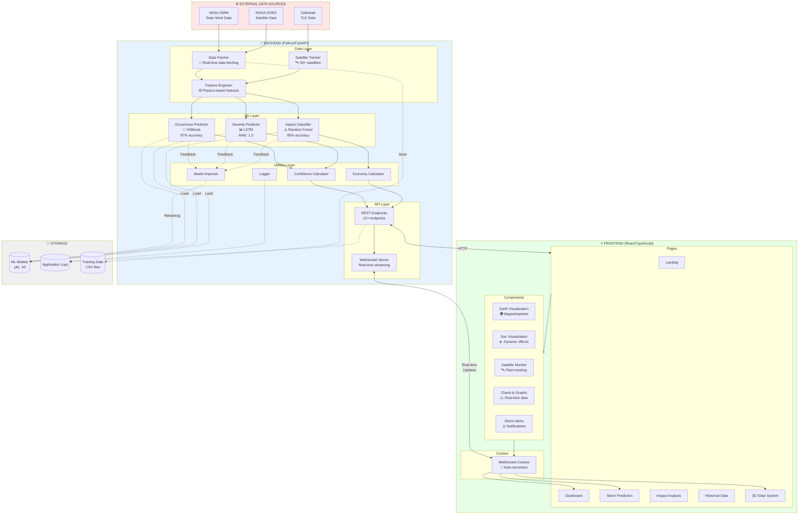
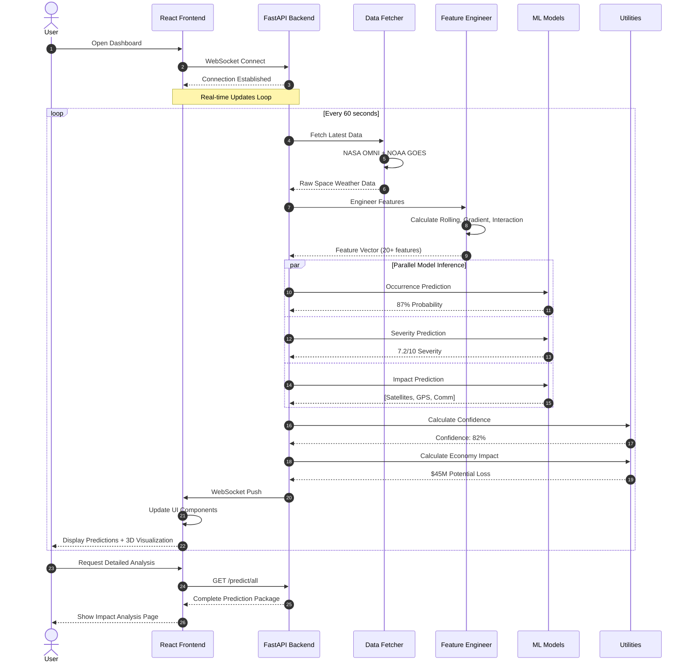
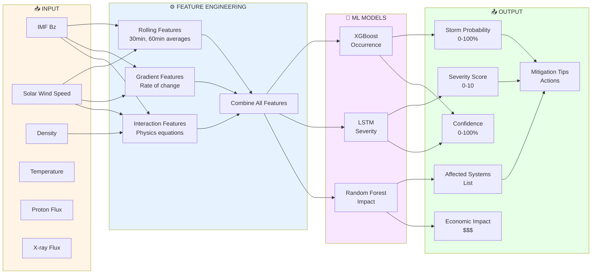
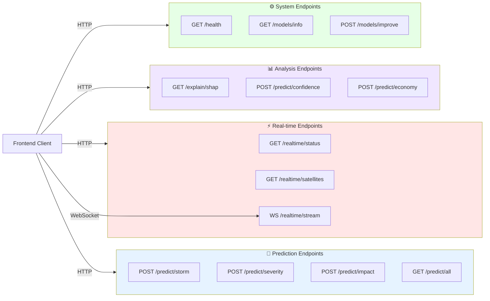
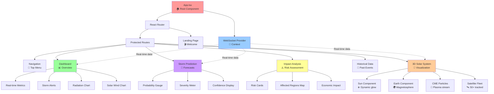
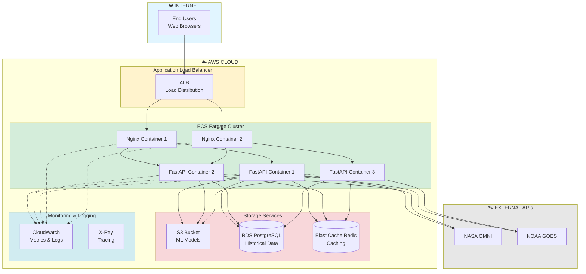
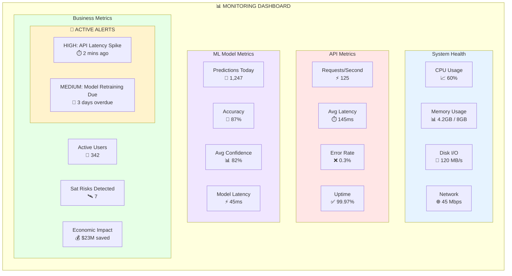
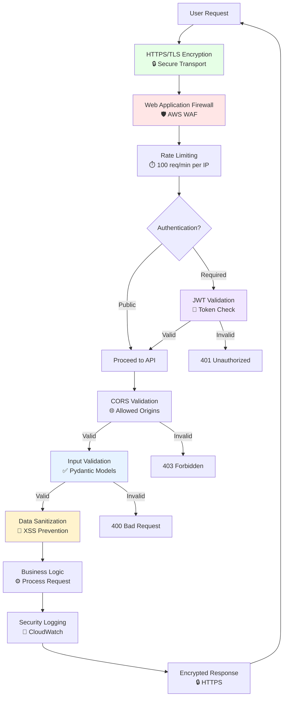

# 🏗️ SolarSheild - System Architecture Diagrams

This document contains comprehensive visual diagrams of the SolarSheild system architecture.

---

## 📐 Complete System Architecture



---

## 🔄 Request-Response Flow



---

## 🎯 Data Processing Pipeline



---

## 🧠 ML Model Architecture

```mermaid
graph TB
    subgraph ModelA["Model A: Storm Occurrence Predictor"]
        A1[Input: 6 Features<br/>Bz, Speed, Density, etc.]
        A2[XGBoost Classifier<br/>100 estimators<br/>max_depth: 5]
        A3[Output: Binary<br/>Storm: Yes/No<br/>Probability: 0-1]
        
        A1 --> A2 --> A3
    end
    
    subgraph ModelB["Model B: Storm Severity Predictor"]
        B1[Input: Time Series<br/>60 timesteps × 6 features]
        B2[LSTM Layer 1<br/>64 units<br/>return_sequences=True]
        B3[LSTM Layer 2<br/>32 units]
        B4[Dense Layer<br/>16 units, ReLU]
        B5[Output Layer<br/>1 unit, Linear]
        B6[Output: Severity<br/>0-10 continuous]
        
        B1 --> B2 --> B3 --> B4 --> B5 --> B6
    end
    
    subgraph ModelC["Model C: Impact Risk Classifier"]
        C1[Input: 8 Features<br/>Severity, Speed, Bz, etc.]
        C2[Random Forest<br/>200 estimators<br/>Multi-label]
        C3[Output: Risk Probabilities<br/>Satellites: 0.92<br/>GPS: 0.78<br/>Communications: 0.85<br/>Power Grid: 0.65]
        
        C1 --> C2 --> C3
    end
    
    style ModelA fill:#ffe6e6
    style ModelB fill:#e6f3ff
    style ModelC fill:#ffe6f7
```



---

## 🌐 API Endpoint Structure



---

## 🎨 Frontend Component Hierarchy



---

## 🐳 Deployment Architecture



---

## 🔄 CI/CD Pipeline

```mermaid
flowchart LR
    Dev[Developer<br/>💻 Commits Code] --> GitHub[GitHub Repository<br/>📦 Source Code]
    
    GitHub --> Actions[GitHub Actions<br/>⚙️ CI/CD Pipeline]
    
    Actions --> Test[Run Tests<br/>✅ Unit & Integration]
    Test --> Lint[Code Linting<br/>📝 PEP8, ESLint]
    Lint --> Build[Build Docker Images<br/>🐳 Backend + Frontend]
    
    Build --> Push[Push to Registry<br/>📤 ECR/DockerHub]
    Push --> Deploy{Deploy Stage}
    
    Deploy -->|Development| DevEnv[Dev Environment<br/>🟡 dev.solarshield.com]
    Deploy -->|Staging| StageEnv[Staging Environment<br/>🟠 staging.solarshield.com]
    Deploy -->|Production| ProdEnv[Production Environment<br/>🟢 solarshield.com]
    
    DevEnv -.-> Monitor[Monitoring<br/>📊 CloudWatch]
    StageEnv -.-> Monitor
    ProdEnv -.-> Monitor
    
    Monitor --> Alert{Issues?}
    Alert -->|Yes| Rollback[Automatic Rollback<br/>⏮️ Previous Version]
    Alert -->|No| Success[Deployment Success<br/>✅ Live]
    
    Rollback --> Notify[Notify Team<br/>📧 Slack/Email]
    Success --> Notify
    
    style Dev fill:#e6f3ff
    style Actions fill:#ffe6e6
    style Deploy fill:#f9e6ff
    style ProdEnv fill:#e6ffe6
    style Success fill:#d4edda
    style Alert fill:#fff3cd
```



---

## 📊 Monitoring Dashboard Layout



---

## 🔐 Security Architecture



---

## 📦 Project Structure Diagram

```
SolarSheild/
│
├── 📂 backend/                      # Python FastAPI Backend
│   ├── 📂 data/                     # Data Layer
│   │   ├── fetcher.py              # 🔄 Data fetching
│   │   ├── feature_engineer.py     # ⚙️ Feature engineering
│   │   └── satellite_tracker.py    # 🛰️ Satellite tracking
│   │
│   ├── 📂 ml/                       # ML Layer
│   │   ├── storm_occurrence.py     # 🎯 XGBoost model
│   │   ├── storm_severity.py       # 📊 LSTM model
│   │   ├── impact_risk.py          # ⚠️ Random Forest model
│   │   └── train_pipeline.py       # 🏋️ Training pipeline
│   │
│   ├── 📂 utils/                    # Utilities
│   │   ├── helpers.py              # 🔧 Helper functions
│   │   ├── confidence_calculator.py # 📊 Confidence metrics
│   │   ├── economy_loss.py         # 💰 Economic calculations
│   │   ├── model_improver.py       # 📈 Model improvement
│   │   └── logger.py               # 📝 Logging
│   │
│   ├── main.py                      # 🚀 FastAPI application
│   ├── config.py                    # ⚙️ Configuration
│   └── Dockerfile                   # 🐳 Docker image
│
├── 📂 frontend/                     # React TypeScript Frontend
│   ├── 📂 src/
│   │   ├── 📂 pages/               # React pages
│   │   │   ├── Landing.tsx         # 🏠 Landing page
│   │   │   ├── Dashboard.tsx       # 📊 Main dashboard
│   │   │   ├── StormPrediction.tsx # 🔮 Predictions
│   │   │   ├── ImpactAnalysis.tsx  # ⚠️ Impact analysis
│   │   │   └── SolarSystem3DView.tsx # 🌌 3D visualization
│   │   │
│   │   ├── 📂 components/          # React components
│   │   │   ├── Navigation.tsx      # 🧭 Navigation bar
│   │   │   ├── StormAlert.tsx      # 🚨 Alerts
│   │   │   ├── EarthVisualization.tsx # 🌍 3D Earth
│   │   │   ├── SatelliteMonitor.tsx # 🛰️ Satellite monitor
│   │   │   └── RealTimeMetrics.tsx # 📊 Live metrics
│   │   │
│   │   ├── 📂 context/             # React context
│   │   │   └── WebSocketContext.tsx # 🔌 WebSocket provider
│   │   │
│   │   ├── App.tsx                 # ⚛️ Root component
│   │   └── index.tsx               # 🚪 Entry point
│   │
│   ├── package.json                # 📦 Dependencies
│   ├── tsconfig.json               # 🔧 TypeScript config
│   └── Dockerfile                  # 🐳 Docker image
│
├── 📂 models/                       # Trained ML Models
│   ├── storm_occurrence.pkl        # 🎯 Occurrence model
│   ├── storm_severity.h5           # 📊 Severity model
│   └── impact_risk.pkl             # ⚠️ Impact model
│
├── 📂 data/                         # Data Storage
│   ├── 📂 raw/                     # Raw data
│   ├── 📂 processed/               # Processed data
│   └── 📂 improvement/             # Improvement data
│
├── 📂 docs/                         # Documentation
│   ├── ARCHITECTURE.md             # 🏗️ Architecture doc
│   ├── DEPLOYMENT.md               # 🚀 Deployment guide
│   └── API_REFERENCE.md            # 📖 API documentation
│
├── 📂 tests/                        # Test Suite
│   ├── test_models.py              # 🧪 Model tests
│   ├── test_api.py                 # 🧪 API tests
│   └── test_integration.py         # 🧪 Integration tests
│
├── docker-compose.yml               # 🐳 Multi-container setup
├── requirements.txt                 # 🐍 Python dependencies
└── README.md                        # 📘 Project overview
```

---

**🌞 SolarSheild - Complete System Architecture**  
**Built for NASA Space Apps Challenge 2026** 🚀

These diagrams provide a comprehensive visual representation of the entire system architecture, from data ingestion to user interface.

